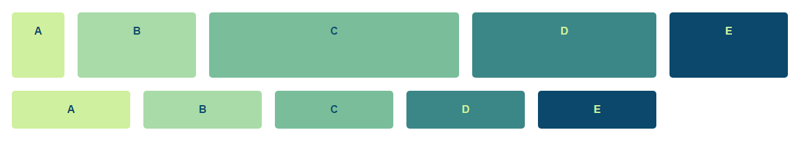
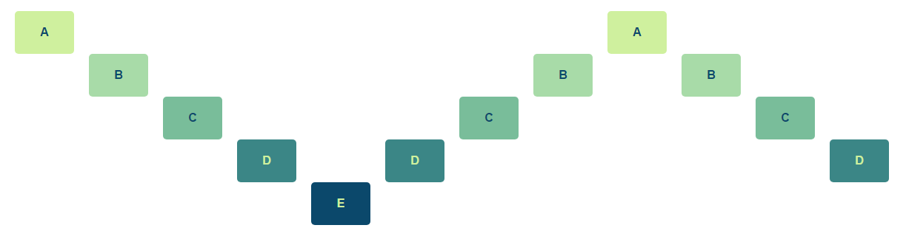
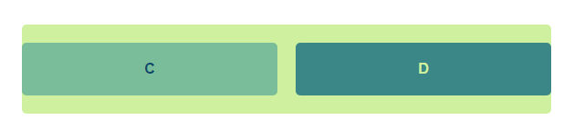
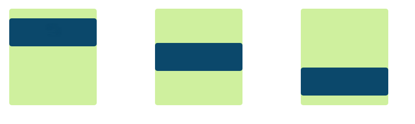
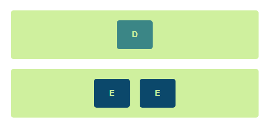

# CSS-Grid 12-Column Layout System

## Rationale

The goal of this demo was to explore the feasibility of [CSS grid](https://www.w3.org/TR/css3-grid-layout/) for implementing a column-based layout system.

### TL;DR

A flexbox-based layout seems better suited for a column-based layout and it's more flexibile when manipulating individual items directly (rather than the container elements) which seems a better fit for a layout system.

Limitations in horizontal and vertical alignment and sizing of individual items are the main drawbacks.

### Pros

- Short code
- Enable additional layout options, particularly at the container level
- Template layouts
- Simplified layout definitions

### Cons

- [Browser support](https://caniuse.com/#feat=css-grid)
- Horizontal alignment: Only implementable in a column-free layout, sized using viewport widths. It's also limited to a single item per row which is solved with nesting (and additional markup).
- [subgrid support](https://rachelandrew.co.uk/archives/2016/04/25/a-revised-subgrid-specification/): The current layout works around it redefining the number of columns when combining a sized item with a grid. It works but it's more of a hack than an actual solution.
- Offsets: Also a hacky alternative, the current layout works around it by using absolute positioning. When absolute offsets are used, sizing of items further on the right is different from those on the left. 
- Elements can be vertically stretched but only when defined by the parent. This limits the number of usable layouts to those that have been pre-defined.

## Usage

Any element can become part of the grid system by adding the `.gl-grid` class. Items within the grid are sized with `.gl-grid__item--{number}` where `{number}` is a 1-12 value indicating the number of columns.

Elements flow horizontally and are sized to the minimum height of the row.



Elements are positioned automatically but if there needs to be space between elements you can position them absolutely. To do that add the class `.gl-grid__item--position-{number}` where `{number}` indicates the column at which the element starts.



Elements can be nested and respect the layout of the parent column if they don't change the size of their box. For instance a subgrid within an element of size 6 would be defined as follows:

```html
<div class="gl-grid">
  <!-- ... -->
  <div class="gl-grid gl-grid__item-6">
    <div class="gl-grid__item-3">C</div>
    <div class="gl-grid__item-3">D</div>
  </div>
</div>
```

And would look like:



An alternative, fraction-based layout is also available. For instance, if we wanted to distribute 2 elements evenly (regardless of their column size), we could do:

```html
<div class="gl-grid--2fr">
  <div class="gl-grid__item-1">C</div>
  <div class="gl-grid__item-1">D</div>
</div>
```

The `fr` in the class name indicates it's fraction-based and the number indicates the number of fractions. Elements don't have to be evenly distributed, for instance, if the first element takes 3 / 4 of the total space and the second one 1 / 4, we would define them as:

```html
<div class="gl-grid--4fr">
  <div class="gl-grid__item-3">C</div>
  <div class="gl-grid__item-1">D</div>
</div>
```

Vertical alignment defaults to the top but can be changed to middle by adding `.gl-grid--middle` to the parent container or to the bottom with `.gl-grid--bottom`.



Horizontal alignment removes the template column layout and relies on viewport units to mimic sizing and spacing. Because of these limitations, only one element can be set per line. To add multiple items you need to wrap them in another element:

```html
  <div class="gl-grid box1 gl-grid--center">
    <div class="gl-grid__item--2">D</div>
  </div>
  <div class="gl-grid box1 gl-grid--center">
    <div class="gl-grid__item--4 gl-grid">
      <div class="gl-grid__item--2">E</div>
      <div class="gl-grid__item--2">E</div>
    </div>
  </div>
```



The grid shrinks when the browser window is smaller than 1280px and locks at that position. To keep the grid centered for these bigger screen sizes you'll need: `.gl-grid-root` and `.gl-grid-content`:

```html
  <div class="gl-grid-root">
    <div class="gl-grid-content">
      <!-- all grids and subgrids go here -->
    </div>
  </div>
```

`.gl-grid-root` defines the full-width container in which `.gl-grid-content` will fit. This results in a page layout limited to 1280px centered.

If you want all sections to go to the edge, for instance if you want to define different background colors for header and footer, you can do instead:

```html
  <body class="gl-grid gl-grid--1-stretch-1">
    <header class="gl-grid-root">
      <div class="gl-grid-content">
        <div class="gl-grid gl-grid--center">Centered Title</div>
      </div>
    </header>
    <main class="gl-grid-root">
      <div class="gl-grid-content">
        <div class="gl-grid">Content goes here</div>
      </div>
    </main>
    <footer class="gl-grid-root">
      <div class="gl-grid-content">
        <div class="gl-grid gl-grid--center">Centered Footer</div>
      </div>
    </footer>
  </body>
```

## Structure

`grid.css` contains the layout system used for this demo. The result can be viewed using the compiled css.

`demo.css` includes all the css that's only relevant for the demo but that doesn't apply to the layout.

`index.html` is the test file used for the screenshots.

margins, gutters and number of columns are parameterizable (by changing the `:root` variables on `grid.css`). To change the `max-width` you'll also need to update the media queries.


## Setup

```bash
$ yarn && yarn build
```

And then open `index.html`.

You can watch for changes with `yarn watch`.
